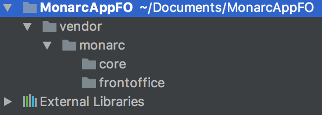
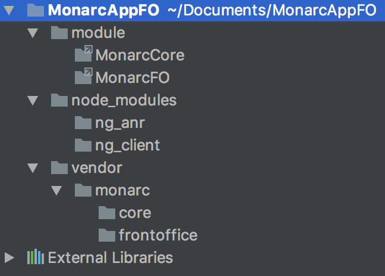
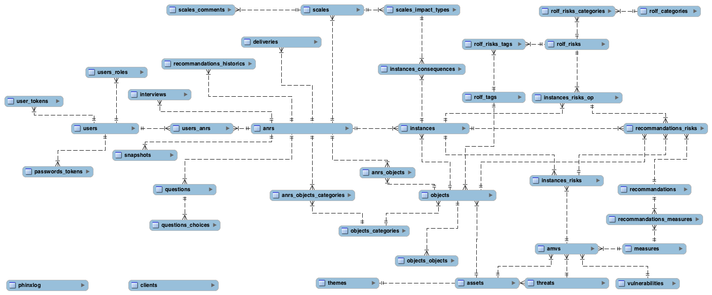

Skeleton Monarc Project
=======================

*Disclaimer: This is a work in progress and software is still in alpha stage.*

Introduction
------------
CASES promotes information security through the use of behavioural, organizational and technical measures. Depending on its size and its security needs, organisations must react in the most appropriate manner.
Adopting good practices, taking the necessary measures and adjusting them proportionally: all this is part of the process to ensure information security. Most of all, it depends on performing a risk analysis on a regular basis.

Although the profitability of the risk analysis approach is guaranteed, the investment represented by this approach in terms of the required cost and expertise is a barrier for many companies, especially SMEs.

To remedy this situation and allow all organisations, both large and small, to benefit from the advantages that a risk analysis offers, CASES has developed an optimised risk analysis method: MONARC (Method for an Optimised aNAlysis of Risks by CASES), allowing precise and repeatable risk management.

The advantage of MONARC lies in the capitalisation of risk analyses already performed in similar business contexts: the same vulnerabilities
regularly appear in many businesses, as they face the same threats and generate similar risks. Most companies have servers, printers, a fleet of smartphones, wi-fi antennas, etc. therefore the vulnerabilities and threats are the same. It is therefore sufficient to generalise risk scenarios for these assets (also called objects) by context and/or business.

More information: [Optimised risk analysis Method] (https://www.cases.lu/index-quick.php?dims_op=doc_file_download&docfile_md5id=56ee6ff569a40a5b52bed0e526a6a77f) (pdf)

Installation
------------

PHP & MySQL
-----------
Install PHP (version 7.0 recommended) with extensions : xml, mbstring, mysql, zip, unzip, mcrypt, intl, gettext, imagick (extension php)
In php.ini, set upload_max_filesize to 200Mo
Install Apache (or Nginx) and enable mods : rewrite, ssl (a2enmod)
  
Install MySQL (version 5.7 recommended) or MariaDb equivalent
       
       
Using Composer (recommended)
----------------------------

Alternately, clone the repository and manually invoke `composer` using the shipped
`composer.phar`:

    cd my/project/dir
    git clone https://github.com/CASES-LU/MonarcAppFO.git ./monarc   
    cd monarc
    php composer.phar self-update
    php composer.phar install -o (modifier le package.json deux errreurs passer en dev-beta le core et il y a un / en trop pour zm-core)

(The `self-update` directive is to ensure you have an up-to-date `composer.phar`
available.)

Databases
---------
Create 2 databases: 

    CREATE DATABASE monarc_cli DEFAULT CHARACTER SET utf8 DEFAULT COLLATE utf8_general_ci;
    CREATE DATABASE monarc_common DEFAULT CHARACTER SET utf8 DEFAULT COLLATE utf8_general_ci;
    
Change Sql Mode in my.cnf:

    [mysqld]
    sql-mode = MYSQL40
    
There is 2 databases: 
* monarc_common contain models and data create by CASES.
* monarc_cli contain all client risks analyses. Each analysis is based on CASES model of monarc_common

Symbolics links
---------------

The project is splited on 2 parts :
* an Api in charge of retrieve data
* an interface to display data

The Api is not direct modules of the project but libraries.
You must create modules with symbolics link to libraries

Create 2 symbolics links at project root: 

    mkdir module
    cd module
    ln -s ./../vendor/monarc/core MonarcCore;
    ln -s ./../vendor/monarc/frontoffice MonarcFO;
    
There is 2 parts:
* one only for front office
* one common for front office and back office (private project)

It is develop with zend framework 2
    

    
Interfaces
----------
Repository for angular  at project root:

    mkdir node_modules
    cd node_modules
    git clone https://github.com/CASES-LU/ng-client.git ng_client
    git clone https://github.com/CASES-LU/ng-anr.git ng_anr    
 
There is 2 parts:
* one only for front office (ng_client)
* one common for front office and back office (private project) (ng_anr)

It is develop with angular framework version 1
  
 
       
Web Server Setup
----------------

### PHP CLI Server

The simplest way to get started if you are using PHP 5.4 or above is to start the internal PHP cli-server in the root directory:

    php -S 0.0.0.0:8080 -t public/ public/index.php

This will start the cli-server on port 8080, and bind it to all network
interfaces.

**Note: ** The built-in CLI server is *for development only*.

### Apache Setup

To setup apache, setup a virtual host to point to the public/ directory of the
project and you should be ready to go! It should look something like below:

    <VirtualHost *:80>
        ServerName monarc.localhost
        DocumentRoot /path/to/monarc/public
        SetEnv APPLICATION_ENV "development"
        <Directory /path/to/monarc/public>
            DirectoryIndex index.php
            AllowOverride All
            Order allow,deny
            Allow from all
        </Directory>
    </VirtualHost>

Database connection
-------------------

Create file `config/autoload/local.php`:

    return array(
        'doctrine' => array(
            'connection' => array(
                'orm_default' => array(
                    'params' => array(
                        'host' => 'host',
                        'user' => 'user',
                        'password' => 'password',
                        'dbname' => 'monarc_common',
                    ),
                ),
                'orm_cli' => array(
                    'params' => array(
                        'host' => 'host',
                        'user' => 'user',
                        'password' => 'password',
                        'dbname' => 'monarc_cli',
                    ),
                ),
            ),
        ),
    );
    
    
Configuration
-------------

Create file configuration

    sudo cp ./config/autoload/local.php.dist ./config/autoload/local.php
    
Update connexion information to local.php and global.php 
   
Configuration files are stored in cache. 
If yours changes have not been considered, empty cache by deleting file in /data/cache

Install Grunt
-------------

    sudo apt-get install nodejs
    sudo apt-get install npm
    sudo npm install -g grunt-cli
    
Only for linux system:
    
    sudo ln -s /usr/bin/nodejs /usr/bin/node (seulement linux)

Update project
--------------
Play script (mandatory from the root of the project)(pull and migrations): 

    sudo /bin/bash ./scripts/update-all.sh
    
This shell script use others shell script. May be you node to change rights of these others files

Create Initial User and Client
------------------------------

Modify email and password (firstname or lastname) of first user in ./module/MonarcFO/migrations/seeds/adminUserInit.php 

If you have a mail server, you can keep default password and click on "Password forgotten ?" after user creation.

Create first user:

    php ./vendor/robmorgan/phinx/bin/phinx seed:run -c ./module/MonarcFO/migrations/phinx.php
    
Data Model
----------

monarc_cli

monarc_common

License
-------

This software is licensed under [GNU Affero General Public License version 3](http://www.gnu.org/licenses/agpl-3.0.html)

Copyright (C) 2016-2017 SMILE gie securitymadein.lu

